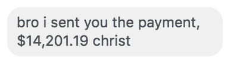
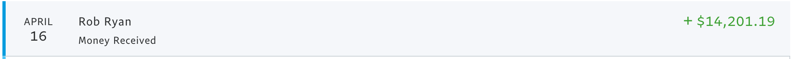

# auto-hound




## Usage 

If you're owed money, and it's 3+ months overdue, the ruby script will email person everyday until invoice is paid, with Harvest invoice(s) in question attached as a PDF. 

Install your dependencies ```git submodule update —init```, then ```sudo gem install active_resource_throttle```. Then retrieve invoice via ```get_invoices.rb (invoice numbers)``` then use the "hound" flag if need be for extra hound assurance, for an email the next day at the same time, you could even set a cron job for this, but for the sake of time you could do: ```get_invoices.rb -h (invoice numbers)```

## Features 

* The "hound flag" which can simply be used by adding "-h" in the command when running the ruby script. For 100% next day hound assurance. 

* Ratelimiting -- We don't want to SPAM these people, but we do want to get paid! 

## Upcoming Features | Updates 

* In version 2.0 there will be an autodialer that will call the company in question and just say the amount owed in a computer generated voice using Loop, or something like TTSAutomate. 
